# 🏗️ Architecture Blueprint — Colégio Villa Prime

**Author:** OPUS-ARCH
**Phase:** 1 (Foundation)
**Purpose:** Definitive architectural reference for ALL agents executing this project.
**Contract:** This document is the single source of truth for code structure.

---

## 1. Project Structure

```
site/
├── astro.config.mjs              # Astro config (static output, sitemap, prefetch)
├── tsconfig.json                  # TypeScript strict
├── package.json                   # Dependencies & scripts
├── .gitignore                     # Node + dist + env exclusions
│
├── public/                        # Static assets (copied as-is to dist)
│   ├── .htaccess                  # Apache security, cache, compression
│   ├── robots.txt                 # Search engine directives
│   ├── favicon.ico                # Favicon
│   ├── favicon.svg                # SVG favicon
│   ├── og-image.jpg               # Default Open Graph image (1200x630)
│   └── images/                    # Site images (optimized)
│       ├── hero/                  # Hero section images
│       ├── gallery/               # Photo gallery
│       ├── icons/                 # Custom icons/illustrations
│       └── team/                  # Team/testimonial photos
│
├── src/
│   ├── layouts/                   # Page layouts
│   │   └── BaseLayout.astro       # Master layout (head, header, footer, scripts)
│   │
│   ├── components/                # Reusable components
│   │   ├── Header.astro           # Site header with navigation
│   │   ├── Footer.astro           # Site footer
│   │   ├── Hero.astro             # Hero section (home page)
│   │   ├── SectionTitle.astro     # Standardized section titles
│   │   ├── CTAButton.astro        # Call-to-action button variants
│   │   ├── FeatureCard.astro      # Feature/pillar cards
│   │   ├── TrustBadge.astro       # Trust indicators
│   │   ├── FAQ.astro              # Accordion FAQ
│   │   ├── TestimonialCard.astro  # Testimonial with avatar
│   │   ├── ContactForm.astro      # Contact form with validation
│   │   ├── WhatsAppButton.astro   # Floating WhatsApp CTA
│   │   ├── Gallery.astro          # Image gallery with lightbox
│   │   ├── SEOHead.astro          # Meta tags, OG, Twitter Card
│   │   └── SchemaOrg.astro        # JSON-LD structured data
│   │
│   ├── pages/                     # File-based routing
│   │   ├── index.astro            # Home page
│   │   ├── proposta-pedagogica.astro
│   │   ├── turmas.astro
│   │   ├── estrutura.astro
│   │   ├── tecnologia.astro
│   │   ├── seguranca.astro
│   │   ├── matriculas.astro
│   │   ├── contato.astro
│   │   └── politica-de-privacidade.astro
│   │
│   ├── styles/                    # Global styles
│   │   └── global.css             # Design tokens + base styles + utilities
│   │
│   ├── scripts/                   # Client-side JS (minimal)
│   │   ├── menu.ts                # Mobile menu toggle
│   │   ├── scroll-reveal.ts       # IntersectionObserver animations
│   │   └── form-validation.ts     # Contact form client validation
│   │
│   └── data/                      # Static data (TypeScript)
│       ├── navigation.ts          # Nav links array
│       ├── features.ts            # Pilares pedagógicos data
│       ├── testimonials.ts        # Depoimentos data
│       ├── faq.ts                 # FAQ data
│       └── school-info.ts         # Endereço, telefone, redes sociais
│
├── scripts/                       # Deploy scripts (CODEX-OPS owns)
│   ├── hostgator-preflight.ps1
│   ├── hostgator-backup.ps1
│   ├── hostgator-deploy.ps1
│   ├── hostgator-rollback.ps1
│   └── hostgator-validate.ps1
│
├── docs/                          # Project documentation
│   ├── 00_GSD_EXECUTION_PLAN.md
│   ├── 01_PRD.md
│   ├── 02_DESIGN_SYSTEM.md
│   ├── 03_INFORMATION_ARCHITECTURE.md
│   ├── 04_TECHNICAL_ARCHITECTURE.md
│   ├── 05_DEPLOYMENT.md
│   ├── 06_SECURITY_LGPD.md
│   ├── 07_SEO_PERFORMANCE.md
│   ├── 08_QA_TEST_PLAN.md
│   ├── 09_OPERATIONS_RUNBOOK.md
│   └── 10_ROLLBACK_INCIDENT.md
│
└── .env.deploy.example            # Deploy credentials template (gitignored values)
```

---

## 2. Component Architecture

### 2.1 BaseLayout.astro

The master layout wrapping ALL pages.

```
┌──────────────────────────────────────────────┐
│ <html lang="pt-BR">                          │
│   <head>                                      │
│     <SEOHead />     ← meta, OG, Twitter       │
│     <SchemaOrg />   ← JSON-LD                 │
│     <link> fonts                               │
│     <link> global.css                          │
│   </head>                                      │
│   <body>                                       │
│     <a class="skip-to-content">                │
│     <Header />                                 │
│     <main id="main-content">                   │
│       <slot />      ← page content injected    │
│     </main>                                    │
│     <Footer />                                 │
│     <WhatsAppButton />                         │
│     <script> scroll-reveal.ts                  │
│   </body>                                      │
│ </html>                                        │
└──────────────────────────────────────────────┘
```

### 2.2 Component Props (TypeScript Interfaces)

```typescript
// SEOHead props
interface SEOHeadProps {
  title: string;
  description: string;
  canonicalURL?: string;
  ogImage?: string;
  ogType?: 'website' | 'article';
  noindex?: boolean;
}

// Hero props
interface HeroProps {
  title: string;
  subtitle: string;
  ctaText: string;
  ctaLink: string;
  backgroundImage: string;
  overlay?: boolean;
}

// SectionTitle props
interface SectionTitleProps {
  title: string;
  subtitle?: string;
  alignment?: 'left' | 'center' | 'right';
  decorated?: boolean;
}

// CTAButton props
interface CTAButtonProps {
  text: string;
  href: string;
  variant: 'primary' | 'secondary' | 'whatsapp' | 'outline';
  size?: 'sm' | 'md' | 'lg';
  icon?: string;
  external?: boolean;
}

// FeatureCard props
interface FeatureCardProps {
  title: string;
  description: string;
  icon: string;
  link?: string;
}

// TestimonialCard props
interface TestimonialCardProps {
  quote: string;
  name: string;
  role: string;
  avatar?: string;
}

// FAQ item
interface FAQItem {
  question: string;
  answer: string;
}

// SchemaOrg props
interface SchemaOrgProps {
  type: 'LocalBusiness' | 'EducationalOrganization' | 'WebPage';
  name?: string;
  description?: string;
  url?: string;
}
```

---

## 3. Page Architecture

### 3.1 Home Page (index.astro) — Sections Order

```
1. Hero Section
   - Background image/gradient
   - H1: "Educação que transforma os primeiros anos"
   - Subtitle
   - CTA: "Agende uma Visita" (WhatsApp)

2. Sobre a Escola
   - Split layout (text + image)
   - Breve história, missão, valores
   - CTA: "Conheça nossa proposta"

3. Pilares Pedagógicos
   - Grid 2x2 ou 3-col
   - FeatureCards: Acolhimento, Desenvolvimento, Segurança, Família

4. Nossos Ambientes
   - Horizontal scroll ou grid
   - Cards com foto + nome do espaço

5. Galeria de Fotos
   - Grid responsivo com lightbox
   - 8-12 fotos selecionadas

6. Depoimentos
   - TestimonialCards (2-3)
   - Estrelas ou selo de verificação

7. FAQ Preview
   - 4-5 perguntas mais comuns
   - Link "Ver todas as perguntas"

8. CTA Final
   - Gradient background
   - "Venha conhecer o Villa Prime"
   - Botão WhatsApp + Telefone
```

### 3.2 Internal Pages Structure

Each internal page follows:
```
Hero Banner (shorter, page-specific)
→ Content Sections (2-4 per page)
→ Related CTA
→ Contact Mini-Section
```

### 3.3 URL Structure

| Page | URL | Priority |
|------|-----|----------|
| Home | `/` | 1.0 |
| Proposta Pedagógica | `/proposta-pedagogica/` | 0.9 |
| Turmas | `/turmas/` | 0.9 |
| Estrutura | `/estrutura/` | 0.8 |
| Tecnologia | `/tecnologia/` | 0.7 |
| Segurança | `/seguranca/` | 0.7 |
| Matrículas | `/matriculas/` | 1.0 |
| Contato | `/contato/` | 0.8 |
| Política de Privacidade | `/politica-de-privacidade/` | 0.3 |

---

## 4. SEO Architecture

### 4.1 Meta Tags (per page)
- `<title>` — Unique, 50-60 chars, keyword-rich
- `<meta name="description">` — Unique, 120-160 chars
- `<link rel="canonical">` — Self-referencing
- Open Graph: og:title, og:description, og:image, og:url, og:type
- Twitter Card: twitter:card, twitter:title, twitter:description

### 4.2 Schema.org (JSON-LD)
```json
{
  "@context": "https://schema.org",
  "@type": ["LocalBusiness", "EducationalOrganization"],
  "name": "Colégio Villa Prime",
  "description": "Escola de educação infantil premium para crianças de 0 a 6 anos",
  "url": "https://www.colegiovillaprime.com.br",
  "telephone": "+55-XX-XXXX-XXXX",
  "address": {
    "@type": "PostalAddress",
    "streetAddress": "...",
    "addressLocality": "...",
    "addressRegion": "...",
    "postalCode": "...",
    "addressCountry": "BR"
  },
  "geo": { "@type": "GeoCoordinates", "latitude": "...", "longitude": "..." },
  "openingHours": "Mo-Fr 07:00-19:00",
  "priceRange": "$$",
  "image": "https://www.colegiovillaprime.com.br/og-image.jpg",
  "sameAs": ["https://www.instagram.com/colegiovillaprime", "https://www.facebook.com/colegiovillaprime"]
}
```

### 4.3 robots.txt
```
User-agent: *
Allow: /
Disallow: /404
Sitemap: https://www.colegiovillaprime.com.br/sitemap-index.xml
```

---

## 5. .htaccess Security & Performance

```apache
# --- Security Headers ---
Header set X-Content-Type-Options "nosniff"
Header set X-Frame-Options "SAMEORIGIN"
Header set X-XSS-Protection "1; mode=block"
Header set Referrer-Policy "strict-origin-when-cross-origin"
Header set Permissions-Policy "camera=(), microphone=(), geolocation=()"

# --- Cache Control ---
<IfModule mod_expires.c>
  ExpiresActive On
  ExpiresByType text/html "access plus 1 hour"
  ExpiresByType text/css "access plus 1 year"
  ExpiresByType application/javascript "access plus 1 year"
  ExpiresByType image/webp "access plus 1 year"
  ExpiresByType image/jpeg "access plus 1 year"
  ExpiresByType image/png "access plus 1 year"
  ExpiresByType image/svg+xml "access plus 1 year"
  ExpiresByType font/woff2 "access plus 1 year"
</IfModule>

# --- Compression ---
<IfModule mod_deflate.c>
  AddOutputFilterByType DEFLATE text/html text/css application/javascript application/json image/svg+xml
</IfModule>

# --- Force HTTPS ---
RewriteEngine On
RewriteCond %{HTTPS} off
RewriteRule ^(.*)$ https://%{HTTP_HOST}%{REQUEST_URI} [L,R=301]

# --- Remove www (or add www — choose one) ---
RewriteCond %{HTTP_HOST} !^www\. [NC]
RewriteRule ^(.*)$ https://www.%{HTTP_HOST}/$1 [R=301,L]

# --- Custom 404 ---
ErrorDocument 404 /404.html
```

---

## 6. Data Architecture

### 6.1 school-info.ts
```typescript
export const schoolInfo = {
  name: 'Colégio Villa Prime',
  tagline: 'Educação que transforma os primeiros anos',
  phone: '(XX) XXXX-XXXX',
  whatsapp: '55XXXXXXXXXXX',
  email: 'contato@colegiovillaprime.com.br',
  address: {
    street: 'Rua ...',
    number: '...',
    neighborhood: '...',
    city: '...',
    state: '...',
    zip: 'XXXXX-XXX',
  },
  social: {
    instagram: 'https://www.instagram.com/colegiovillaprime',
    facebook: 'https://www.facebook.com/colegiovillaprime',
  },
  hours: 'Segunda a Sexta, 7h às 19h',
  ageRange: '0 a 6 anos',
  founded: 2026,
} as const;
```

### 6.2 navigation.ts
```typescript
export const mainNav = [
  { label: 'Início', href: '/' },
  { label: 'Proposta Pedagógica', href: '/proposta-pedagogica/' },
  { label: 'Turmas', href: '/turmas/' },
  { label: 'Estrutura', href: '/estrutura/' },
  { label: 'Tecnologia', href: '/tecnologia/' },
  { label: 'Segurança', href: '/seguranca/' },
  { label: 'Matrículas', href: '/matriculas/', highlight: true },
  { label: 'Contato', href: '/contato/' },
] as const;
```

---

## 7. Execution Diagram

```mermaid
graph LR
    subgraph "Phase 1 — OPUS-ARCH"
        A[Architecture Blueprint] --> B[Design System Tokens]
        B --> C[Component Interfaces]
        C --> D[Page Structure Specs]
        D --> E[SEO Architecture]
        E --> F[Data Models]
    end
    
    subgraph "Phase 1 — CODEX-OPS"
        G[Scaffold Astro] --> H[Install Dependencies]
        H --> I[Configure Build]
        I --> J[Create File Structure]
        J --> K[Verify Build]
    end
    
    subgraph "Phase 2 — GEMINI-UX"
        L[Implement Components] --> M[Style with Tailwind]
        M --> N[Add Animations]
        N --> O[Responsive Testing]
    end
    
    F --> G
    K --> L
```



---

*Architecture Blueprint v1.0 — Created 2026-05-17T23:30:00Z by OPUS-ARCH*
*This is the definitive reference. All agents MUST follow this structure.*
