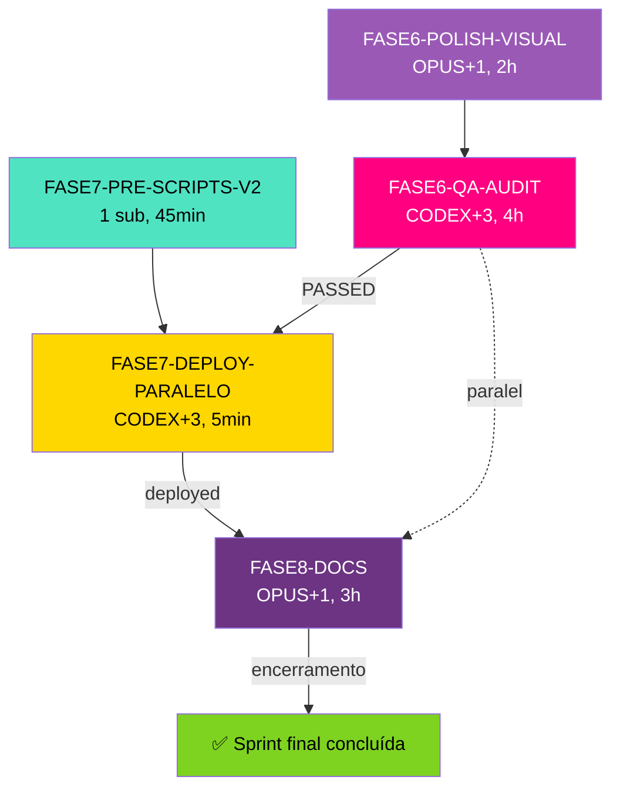

# 🚀 FINAL SPRINT PLAN — Colégio Villa Prime
## Sprint final: Fase 6.A → Fase 8 (Polish → QA → Deploy → Docs)

> **Criado**: 2026-05-18 por OPUS-ARCH
> **Status**: ✅ Plano aprovado pelo usuário (GO em 2026-05-17T23:50)
> **Modelo**: Multi-agent paralelo com slots dimensionados por agente
> **Skills disponíveis**: 1.510 skills senior em `C:\Users\dataops-lab\.gemini\antigravity\skills`

---

## 📊 Estado Atual Confirmado

| Fase | Status | Evidência |
|---|---|---|
| Pre-0 Discovery | ✅ DONE | `.firecrawl/`, PROJECT.md, REQUIREMENTS.md (54 reqs) |
| 1 Foundation | ✅ DONE | Astro+TS+Tailwind v4, build OK, 9 page shells |
| 2 Components | ✅ DONE | 15 componentes + 5 data files (CHECKIN #008) |
| 3 Home Page | ✅ DONE | index.astro 791 linhas, 8 seções (CHECKIN #010) |
| 4 Internal Pages | ✅ DONE | 5 páginas institucionais (CHECKIN #011) |
| 5 Conversion Pages | ✅ DONE | matriculas + contato + privacidade + 5.4 validado (CHECKIN #015) |
| **D-007 DS v3.0** | ✅ **DONE** | 0 ocorrências de Playfair/Deep Teal; tokens vp-purple/Fredoka aplicados em todos componentes/páginas |
| Phase 7 scripts v1 | ✅ DONE | 5 scripts HostGator (CHECKIN #011) |
| Phase 8 docs parcial | 🟡 8/16+ | DESIGN-SYSTEM, COMPONENT-CATALOG, DEPLOY-GUIDE, BACKUP-STRATEGY, TROUBLESHOOTING, SECURITY-HEADERS, SEO-CHECKLIST, CONTENT-GUIDE |

---

## 🎯 O Que Falta — Sprint Final (5 prompts)

### Prompt 1 — `FASE6-POLISH-VISUAL.md` (2 slots: OPUS + 1 sub)
- Diff visual contra `design_system/index.html` + fixes finos CSS
- Skills: `design-taste-frontend`, `frontend-developer`
- Tempo: ~2h00
- Entregável: `POLISH-VISUAL-DIFF.md`, fixes aplicados, `V1.1-BACKLOG.md`

### Prompt 2 — `FASE7-PRE-SCRIPTS-V2.md` (1 slot único)
- **Roda em paralelo a Prompt 1** (não bloqueia)
- Reescreve scripts deploy v1 sequencial → v2 atomic staged paralelo
- Skills: `deployment-pipeline-design`, `deployment-procedures`
- Tempo: ~45min
- Entregável: 8 scripts v2 + `site/scripts/README.md` + 3 docs atualizados + v1 arquivado

### Prompt 3 — `FASE6-QA-AUDIT.md` (4 slots: CODEX + 3 subs)
- QA completo: Lighthouse + A11y + SEO + Bundle + E2E Playwright
- Skills: `audit-skills`, `application-performance-performance-optimization`, `accessibility-compliance-accessibility-audit`, `fixing-accessibility`, `ai-seo`, `local-legal-seo-audit`, `awt-e2e-testing`
- Tempo: ~4h00 (gargalo Lighthouse + 1 fix loop)
- Entregável: 4 reports + QA-SUMMARY.md + E2E evidence
- Metas: Perf≥90, A11y≥95, BP≥95, SEO≥95 em todas 9 páginas

### Prompt 4 — `FASE7-DEPLOY-PARALELO.md` (4 slots: CODEX + 3 subs)
- Deploy real para HostGator com atomic staged switch
- Skills: `deployment-pipeline-design`, `deployment-validation-config-validate`, `deployment-procedures`, `awt-e2e-testing`, `application-performance-performance-optimization`
- Tempo: ~5min de janela real (zero downtime, switch <1s, rollback <2s)
- Entregável: site publicado + DEPLOY-REPORT.md + evidências
- **Bloqueador**: SSH credentials do usuário (a fornecer no momento)

### Prompt 5 — `FASE8-DOCS.md` (2 slots: OPUS + 1 sub)
- **Roda em paralelo** a Prompt 3 e 4 (a partir do meio da Fase 6.B)
- README final + CONTRIBUTING + 3 ADRs + 5º Mermaid + fechamento de handoffs/reviews/statistics
- Skills: `audit-skills`, `content-creator`
- Tempo: ~3h00
- Entregável: `README.md`, `CONTRIBUTING.md`, ADR-004/005/006, ROADMAP atualizado, CHECKIN-LOG fechado

---

## ⏱️ Timeline Visual

```
              0h ────── 2h ────── 4h ─── 6h30 ─── 7h ──── 9h ──── 11h
P1 (OPUS+1)   │ Polish Visual (2h)         │
              ├ handoff
P2 (1 slot)   │ Scripts v2 (45min, paralelo a P1)
                                  │ handoff
P3 (CODEX+3)                      │ QA Audit (4h: 1 main + 3 subs paralelos) │
                                  │ + 1 fix loop
                                                       │ handoff + SSH user
P4 (CODEX+3)                                           │ Deploy (5min real) │
P5 (OPUS+1)                       │ Docs Final (3h, paralelo a P3 e P4)     │
                                                                ├ encerramento sprint

CRÍTICO TOTAL:  ~7h (otimista) | ~9h (realista) | ~11h (conservador)
```

---

## 🔄 Mapa de Dependências



---

## 🤖 Modelo de Execução por Agente

| Agente | Slots máx | Quando aciona |
|---|---|---|
| **OPUS-ARCH** (eu, coordenador) | `1 main + 1 sub` | Sou main em P1 e P5; oriento todos |
| **CODEX-OPS** | `1 main + 3 subs` (4 paralelos) | Main em P3, P4. Sub único em P2. |
| **GEMINI-UX** | sub-agente sob demanda | Sub em P1 (frontend-developer) |

---

## 🛠️ Skills Carregadas Antecipadamente

Pré-aquecidas no início da sprint para reduzir warm-up dos sub-agents:

```
P1 — Polish Visual:
  ├─ design-taste-frontend     (OPUS main)
  └─ frontend-developer        (sub)

P2 — Scripts v2:
  └─ deployment-pipeline-design + deployment-procedures (sub)

P3 — QA Audit:
  ├─ audit-skills              (CODEX main)
  ├─ application-performance-performance-optimization (sub A: Lighthouse+Bundle)
  ├─ accessibility-compliance-accessibility-audit + fixing-accessibility (sub B: A11y)
  └─ ai-seo + local-legal-seo-audit (sub C: SEO)

P4 — Deploy:
  ├─ deployment-pipeline-design (CODEX main)
  ├─ deployment-validation-config-validate (sub A: preflight+backup)
  ├─ deployment-procedures      (sub B: rsync paralelo)
  └─ awt-e2e-testing + application-performance-performance-optimization (sub C: smoke+lighthouse pós)

P5 — Docs:
  ├─ audit-skills              (OPUS main)
  └─ content-creator           (sub)
```

Skills sob demanda (não pré-carregadas): `landing-page-generator`, `codebase-cleanup-deps-audit`, `codebase-audit-pre-push`.

---

## 📋 Quality Gates Mestres (não-negociáveis)

| Gate | Threshold | Bloqueia... |
|---|---|---|
| Build | `npm run build` exit 0 | TUDO |
| Lighthouse Performance | ≥ 90 / 9 páginas | P4 (Deploy) |
| Lighthouse A11y | ≥ 95 / 9 páginas | P4 |
| Lighthouse BP | ≥ 95 / 9 páginas | P4 |
| Lighthouse SEO | ≥ 95 / 9 páginas | P4 |
| Axe critical | 0 violações / 9 páginas | P4 |
| Schema.org | 100% válido | P4 |
| Contraste WCAG 2.1 AA | 4.5:1 texto, 3:1 large | P3 |
| Sem credenciais em repo | `grep` retorna 0 | P4 |
| Backup criado antes de deploy | tar.gz remoto OK | Atomic switch |
| Smoke pós-deploy | 9 rotas HTTP 200 | Marcar `COMPLETED` |
| HTTPS válido | Cert + HSTS + redirect 301 | Marcar `COMPLETED` |
| Handoffs fechados | 0 `⏳ WAITING` | P5 (encerramento) |
| Review requests resolvidas | 0 `⏳ PENDING` | P5 (encerramento) |

---

## 📂 Arquivos de Controle (verificar a cada fim de fase)

OPUS-ARCH (eu) verifica obrigatoriamente:

| Arquivo | O que checar |
|---|---|
| `.planning/CHECKIN-LOG.md` | Entrada `COMPLETED` com timestamp + evidência por agente |
| `.planning/ROADMAP.md` | Status da fase atualizado |
| `.planning/CHECKIN-LOG.md > Handoff Queue` | Handoffs da fase fechados |
| `.planning/CHECKIN-LOG.md > Review Requests` | Reviews resolvidos |
| `.planning/CHECKIN-LOG.md > Decision Log` | Decisões novas registradas |
| `.planning/CHECKIN-LOG.md > Violation Log` | Sem novas violações |
| Quality Gates (`AGENT-CONTRACT.md` §5) | Gates aplicáveis atingidos |

Se algum agente não reportar corretamente → bloqueio o avanço e exijo o check-in retroativo.

---

## 🚦 Status de Execução

### Step 0 — Pré-sprint (em andamento)
- [x] Reler prompts antigos (FASE7-DEPLOY, FASE7+8-PARALELO, FASE8-DOCS)
- [x] Reescrever `FASE6-POLISH-VISUAL.md` (148 linhas)
- [x] Reescrever `FASE6-QA-AUDIT.md` (251 linhas)
- [x] Criar `FASE7-PRE-SCRIPTS-V2.md` (274 linhas)
- [x] Reescrever `FASE7-DEPLOY-PARALELO.md` (291 linhas)
- [x] Reescrever `FASE8-DOCS.md` (261 linhas)
- [x] Criar este `FINAL-SPRINT-PLAN.md`
- [ ] Fechar handoffs históricos (R-001, R-002, H-001..H-010 conforme cumpridos)
- [ ] Apresentar checklist final ao usuário com GO/no-go

### Step 1 — Sprint final (aguarda GO do usuário)
- [ ] P1 + P2 disparados em paralelo
- [ ] P3 disparado após P1 entregar
- [ ] P5 disparado em paralelo a P3 (a partir do meio)
- [ ] P4 disparado após P3 PASSED + SSH credentials do usuário
- [ ] Encerramento da sprint (final do P5)

---

## 🎁 Entregáveis Finais Esperados

### Site
- 9 páginas estáticas publicadas em produção
- Lighthouse ≥ targets em produção
- Zero downtime deploy
- Backup + rollback ready

### Documentação
- 16+ docs em `site/docs/` cobrindo design, componentes, deploy, QA, troubleshooting, content guide, security
- README + CONTRIBUTING na raiz
- 6 ADRs (D-001..D-006 originais + ADR-004, 005, 006 novos)
- 5+ diagramas Mermaid

### Governança
- 8/8 fases ✅ DONE no ROADMAP
- 0 handoffs `⏳ WAITING`
- 0 reviews `⏳ PENDING`
- Statistics atualizadas no CHECKIN-LOG
- V1.1 backlog para próximas iterações

---

## 📞 Pontos de Contato com o Usuário

| Quando | Por quê |
|---|---|
| ❶ Antes de iniciar P4 (Deploy) | SSH credentials + janela ideal |
| ❷ Se algum gate falhar 2x consecutivos | Decisão sobre tradeoff/escalação |
| ❸ Após P3 (QA) — checkpoint opcional | Revisar QA-SUMMARY antes do deploy |
| ❹ Após P4 (Deploy) — confirmação | Validar visualmente o site no domínio |
| ❺ Encerramento da sprint | Apresentar resumo + métricas + V1.1 backlog |

---

## 🔗 Links Rápidos (5 prompts da sprint)

1. [`FASE6-POLISH-VISUAL.md`](./prompts/FASE6-POLISH-VISUAL.md) — Polish Visual DS v3.0
2. [`FASE7-PRE-SCRIPTS-V2.md`](./prompts/FASE7-PRE-SCRIPTS-V2.md) — Reescrita scripts deploy v2
3. [`FASE6-QA-AUDIT.md`](./prompts/FASE6-QA-AUDIT.md) — QA Audit completo
4. [`FASE7-DEPLOY-PARALELO.md`](./prompts/FASE7-DEPLOY-PARALELO.md) — Deploy HostGator paralelo
5. [`FASE8-DOCS.md`](./prompts/FASE8-DOCS.md) — Documentação final + encerramento

Arquivos de governança:
- [`.planning/AGENT-CONTRACT.md`](./AGENT-CONTRACT.md)
- [`.planning/CHECKIN-LOG.md`](./CHECKIN-LOG.md)
- [`.planning/ROADMAP.md`](./ROADMAP.md)
- [`.planning/DESIGN-SYSTEM-V3.md`](./DESIGN-SYSTEM-V3.md)
- [`.planning/ADRs.md`](./ADRs.md)

---

*Plano criado: 2026-05-18T02:35Z por OPUS-ARCH (Claude)*
*Aprovação do usuário: 2026-05-17T23:50 (GO)*
*Última atualização: durante Step 0 da sprint final*
