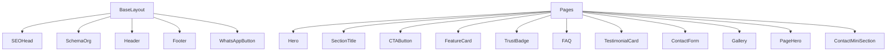

<!--
  @file COMPONENT-CATALOG.md
  @description Component catalog with props, variants, and usage examples.
  @author CODEX-OPS
  @phase 8
  @created 2026-05-18T00:49:31Z
  @modified 2026-05-18T00:49:31Z
-->

# Component Catalog

Este catálogo cobre os 15 artefatos da Fase 2: `BaseLayout` mais 14 componentes. Também registra os 2 componentes adicionados na Fase 4 porque já fazem parte do sistema real.



## Phase 2 Components

### BaseLayout

Path: `site/src/layouts/BaseLayout.astro`

Master layout with SEO, Schema.org, Header, Footer, floating WhatsApp button and scroll reveal.

```ts
interface Props {
  title: string;
  description: string;
  canonicalURL?: string;
  ogImage?: string;
  ogType?: 'website' | 'article';
  noindex?: boolean;
  schemaType?: 'LocalBusiness' | 'EducationalOrganization' | 'WebPage' | 'Default';
  bodyClass?: string;
}
```

```astro
---
import BaseLayout from '../layouts/BaseLayout.astro';
---

<BaseLayout title="Contato" description="Fale com o Colégio Villa Prime.">
  <main>...</main>
</BaseLayout>
```

Visual: layout institucional com header sticky, footer completo, botao WhatsApp fixo e fontes Google.

### Header

Path: `site/src/components/Header.astro`

Navigation header sourced from `src/data/navigation.ts`. Includes responsive mobile menu and primary CTA.

Props: none.

```astro
<Header />
```

Visual: sticky, transparent over hero and solid on scroll, with premium spacing and mobile drawer behavior.

### Footer

Path: `site/src/components/Footer.astro`

Footer with brand, contact data, quick links and legal links.

Props: none.

```astro
<Footer />
```

Visual: multi-column institutional footer using Deep Teal surfaces and clear contact hierarchy.

### Hero

Path: `site/src/components/Hero.astro`

Full-bleed home hero with optional background image, parallax, eyebrow, H1, subtitle and two CTAs.

```ts
interface Props {
  eyebrow?: string;
  title: string;
  subtitle: string;
  primaryCta?: { text: string; href: string; whatsapp?: boolean };
  secondaryCta?: { text: string; href: string };
  backgroundImage?: string;
  disableParallax?: boolean;
}
```

```astro
<Hero
  eyebrow="EDUCAÇÃO INFANTIL"
  title="Educação que transforma os primeiros anos"
  subtitle="Acolhimento, desenvolvimento integral e segurança."
  backgroundImage="/images/hero/home.svg"
/>
```

Variants: parallax on/off, background image or gradient fallback, WhatsApp or primary CTA.

Visual: full viewport, dark teal overlay, gold halo, staggered entrance, scroll cue.

### SectionTitle

Path: `site/src/components/SectionTitle.astro`

Reusable section header with tag, title, subtitle and decorative divider.

```ts
interface Props {
  tag?: string;
  title: string;
  subtitle?: string;
  alignment?: 'left' | 'center' | 'right';
  decorated?: boolean;
  level?: 1 | 2 | 3;
}
```

```astro
<SectionTitle
  tag="PROPOSTA"
  title="Quatro fundamentos que sustentam nossa pedagogia"
  subtitle="Princípios que guiam o cotidiano da escola."
/>
```

Variants: alignment `left`, `center`, `right`; divider on/off; heading level 1/2/3.

Visual: gold tag pill, Playfair heading and animated gold underline.

### CTAButton

Path: `site/src/components/CTAButton.astro`

Universal link CTA.

```ts
interface Props {
  text: string;
  href: string;
  variant?: 'primary' | 'secondary' | 'whatsapp' | 'outline';
  size?: 'sm' | 'md' | 'lg';
  external?: boolean;
  class?: string;
  ariaLabel?: string;
}
```

```astro
<CTAButton text="Agende uma visita" href="/matriculas/" variant="primary" size="lg" />
```

Variants: `primary`, `secondary`, `whatsapp`, `outline`; sizes `sm`, `md`, `lg`.

Visual: rounded pill, icon/arrow, hover lift and accessible focus ring.

### FeatureCard

Path: `site/src/components/FeatureCard.astro`

Pedagogical pillar card with inline SVG icon.

```ts
interface Props {
  title: string;
  description: string;
  icon: string;
  link?: string;
  delay?: number;
}
```

```astro
<FeatureCard
  title={feature.title}
  description={feature.description}
  icon={feature.icon}
  link={feature.link}
/>
```

Visual: elevated card, 64px icon, text hierarchy and optional inline link.

### TrustBadge

Path: `site/src/components/TrustBadge.astro`

Numeric trust indicator with count-up.

```ts
interface Props {
  value: number;
  suffix?: string;
  prefix?: string;
  label: string;
  delay?: number;
  duration?: number;
}
```

```astro
<TrustBadge value={500} suffix="+" label="Famílias atendidas" />
```

Visual: large Playfair number with gold gradient and uppercase label.

### FAQ

Path: `site/src/components/FAQ.astro`

Accessible native accordion using `<details>` and optional Schema.org FAQPage JSON-LD.

```ts
interface Props {
  items?: readonly FAQItem[];
  schema?: boolean;
}
```

```astro
<FAQ items={faqItems} schema={true} />
```

Variants: default FAQ data or custom items; Schema.org on/off.

Visual: stacked accordions with teal chevron, open-state border and soft animation.

### TestimonialCard

Path: `site/src/components/TestimonialCard.astro`

Quote card with optional avatar and rating.

```ts
interface Props {
  quote: string;
  name: string;
  role: string;
  avatar?: string;
  rating?: 1 | 2 | 3 | 4 | 5;
  delay?: number;
}
```

```astro
<TestimonialCard
  quote={testimonial.quote}
  name={testimonial.name}
  role={testimonial.role}
  avatar={testimonial.avatar}
  rating={testimonial.rating}
/>
```

Visual: editorial quote treatment, avatar, parent role and optional rating.

### ContactForm

Path: `site/src/components/ContactForm.astro`

Contact form with floating labels, honeypot, LGPD consent and client-side validation.

```ts
interface Props {
  action?: string;
  id?: string;
}
```

```astro
<ContactForm action="/api/contact" id="matricula-form" />
```

Variants: custom `action` and `id`.

Visual: elevated white form, underlined inputs, gold focus glow and loading state.

### WhatsAppButton

Path: `site/src/components/WhatsAppButton.astro`

Floating WhatsApp action.

```ts
interface Props {
  message?: string;
  tooltip?: string;
}
```

```astro
<WhatsAppButton tooltip="Fale conosco no WhatsApp" />
```

Visual: fixed bottom-right green WhatsApp button with tooltip.

### Gallery

Path: `site/src/components/Gallery.astro`

Responsive gallery with double-bezel framing and native dialog lightbox.

```ts
interface GalleryImage {
  src: string;
  alt: string;
  caption?: string;
  aspect?: string;
}

interface Props {
  images: readonly GalleryImage[];
  id?: string;
  stagger?: number;
}
```

```astro
<Gallery
  id="ambientes"
  images={[
    { src: '/images/gallery/sala.webp', alt: 'Sala de aula', caption: 'Sala de aula' },
  ]}
/>
```

Variants: custom gallery id, custom stagger and per-image aspect ratio.

Visual: 1/2/3-column grid, hover zoom, overlay icon, keyboard lightbox.

### SEOHead

Path: `site/src/components/SEOHead.astro`

Centralized document metadata.

```ts
interface Props {
  title: string;
  description: string;
  canonicalURL?: string;
  ogImage?: string;
  ogType?: 'website' | 'article';
  noindex?: boolean;
}
```

```astro
<SEOHead title="Turmas" description="Conheça as turmas do Colégio Villa Prime." />
```

Visual: not rendered. Produces title, meta description, canonical, robots, Open Graph, Twitter Card and favicon links.

### SchemaOrg

Path: `site/src/components/SchemaOrg.astro`

Outputs JSON-LD for the school or page.

```ts
interface Props {
  type?: 'LocalBusiness' | 'EducationalOrganization' | 'WebPage' | 'Default';
  name?: string;
  description?: string;
  url?: string;
}
```

```astro
<SchemaOrg type="WebPage" name="Turmas" description="Turmas da educação infantil." />
```

Visual: not rendered. Produces `application/ld+json`.

## Added After Phase 2

### PageHero

Path: `site/src/components/PageHero.astro`

Compact internal-page hero with breadcrumbs and BreadcrumbList JSON-LD.

```ts
interface Crumb {
  label: string;
  href?: string;
}

interface Props {
  eyebrow?: string;
  title: string;
  subtitle?: string;
  breadcrumbs: readonly Crumb[];
  backgroundImage?: string;
}
```

```astro
<PageHero
  eyebrow="PROPOSTA"
  title="Proposta Pedagógica"
  breadcrumbs={[{ label: 'Início', href: '/' }, { label: 'Proposta Pedagógica' }]}
/>
```

Visual: compact dark hero, breadcrumb trail, optional eyebrow and gold halo.

### ContactMiniSection

Path: `site/src/components/ContactMiniSection.astro`

Internal-page contact strip with phone, email and CTA buttons.

```ts
interface Props {
  title?: string;
  subtitle?: string;
}
```

```astro
<ContactMiniSection title="Agende uma visita" />
```

Visual: three-column contact band on desktop, stacked on tablet/mobile.

## Implementation Notes

- Components use CSS custom properties from `global.css`.
- Interactive components include focus-visible styles.
- Motion must respect `prefers-reduced-motion`.
- Icons are inline SVG and should use `currentColor` unless brand color is required.
- Public image paths start at `/images/...` because `public/` is copied to site root.
