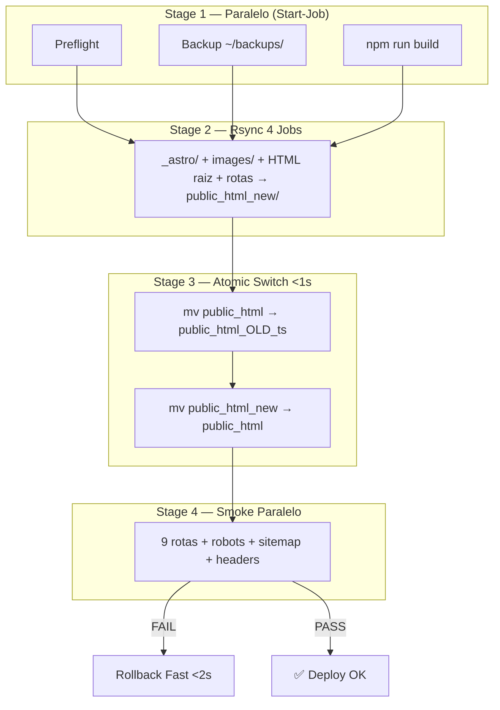

<!--
  @file DEPLOY-GUIDE.md
  @description HostGator SSH/rsync deployment guide — v2 atomic staged parallel.
  @author CODEX-OPS
  @phase 7-PRE
  @created 2026-05-18T00:26:30Z
  @modified 2026-05-18T00:16:32Z
-->

# Deploy Guide — v2 Atomic Staged Parallel

Este projeto publica arquivos estáticos do Astro no HostGator via SSH/rsync com **zero downtime**, conforme ADR-003.

## Pré-requisitos

- Node.js compatível com `package.json`
- PowerShell 5.1+ (Windows) ou 7+ (cross-platform)
- `ssh`, `rsync`, `curl.exe` e `npm` disponíveis no PATH
- Chave SSH configurada no HostGator para o usuário `cri07713`
- Arquivo `site/.env.deploy.local` criado a partir de `site/scripts/.env.deploy.example`

```env
DEPLOY_HOST=xxx.xxx.xxx.xxx
DEPLOY_USER=cri07713
DEPLOY_PATH=/home2/cri07713/public_html
DEPLOY_PORT=22
DEPLOY_DOMAIN=https://www.colegiovillaprime.com.br
```

## Pipeline v2



## Deploy Completo

```powershell
cd site/scripts
.\hostgator-deploy-v2.ps1
```

O orquestrador executa automaticamente:
1. **Stage 1** — Preflight + Backup + Build em paralelo
2. **Stage 2** — 4 rsync paralelos para `public_html_new/` (sem tocar produção)
3. **Stage 3** — Atomic switch: `mv` duplo (<1s de janela)
4. **Stage 4** — Smoke test 9 rotas em paralelo

Se o smoke falhar, rollback automático é executado (<2s).

## Opções do Orquestrador

| Flag | Efeito |
|------|--------|
| `-DryRun` | Simula sem alterar produção |
| `-SkipBackup` | Pula backup (re-deploys rápidos) |
| `-SkipPreflight` | Pula validação SSH/env |
| `-StagedDir <name>` | Nome do dir staged (default: `public_html_new`) |

## Rollback

### Rollback Rápido (<2s) — Recomendado

```powershell
.\hostgator-rollback-fast.ps1
```

Reverte via `mv` usando a versão `*_OLD_*` mais recente.

### Rollback de Emergência (~30s)

```powershell
.\hostgator-rollback-tar.ps1
```

Restaura de backup tar.gz. Usar apenas se rollback-fast falhar.

### Rollback de versão específica

```powershell
.\hostgator-rollback-fast.ps1 -Version 1716000000
.\hostgator-rollback-tar.ps1 -BackupFile backup_20260518_001500.tar.gz
```

## Scripts Individuais

| Script | Uso |
|--------|-----|
| `hostgator-preflight.ps1` | Validar pré-condições antes de deploy |
| `hostgator-backup.ps1` | Criar backup manual |
| `hostgator-rsync-parallel.ps1` | Upload para staged dir |
| `hostgator-atomic-switch.ps1` | Switch manual (após rsync) |
| `hostgator-smoke-parallel.ps1` | Smoke test manual |

## Troubleshooting Rápido

| Sintoma | Verificar |
|---|---|
| SSH falha no preflight | Chave SSH, `DEPLOY_HOST`, `DEPLOY_USER`, `DEPLOY_PORT`, liberação SSH no cPanel |
| Build falha | `npm install`, erros TypeScript/Astro |
| rsync falha | `rsync` no PATH, permissões SSH, quota disco |
| Atomic switch falha | Permissão de mv no parent dir, staged dir existe |
| Smoke falha pós-switch | Rollback automático executado; verificar logs |
| 404 após deploy | `DEPLOY_PATH`, `build.format = 'directory'`, `.htaccess` |

## Migração de v1

Os scripts v1 (sequenciais, com downtime) estão arquivados em `site/scripts/v1-archive/`.
O pipeline v2 é retrocompatível com a mesma `.env.deploy.local`.
