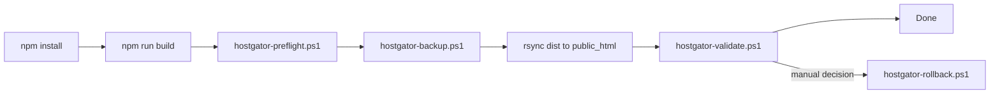

<!--
  @file DEPLOY-GUIDE.md
  @description HostGator SSH/rsync deployment guide.
  @author CODEX-OPS
  @phase 8
  @created 2026-05-18T00:26:30Z
  @modified 2026-05-18T00:26:30Z
-->

# Deploy Guide

Este projeto publica arquivos estáticos do Astro no HostGator via SSH/rsync, conforme ADR-003.

## Pré-requisitos

- Node.js compatível com `package.json`.
- PowerShell no ambiente local.
- `ssh`, `rsync`, `curl.exe` e `npm` disponíveis no PATH.
- Chave SSH configurada no HostGator para o usuário `cri07713`.
- Arquivo `site/.env.deploy.local` criado a partir de `site/scripts/.env.deploy.example`.

```env
DEPLOY_HOST=xxx.xxx.xxx.xxx
DEPLOY_USER=cri07713
DEPLOY_PATH=/home2/cri07713/public_html
DEPLOY_PORT=22
```

## Pipeline



## Passo a Passo

1. Instalar dependências:

```powershell
cd site
npm install
```

2. Build local:

```powershell
npm run build
```

3. Preflight:

```powershell
.\scripts\hostgator-preflight.ps1
```

4. Backup remoto manual, se necessário:

```powershell
.\scripts\hostgator-backup.ps1
```

5. Deploy completo:

```powershell
.\scripts\hostgator-deploy.ps1
```

O deploy chama preflight e backup antes do `rsync`. Se a validação final falhar, o script emite warning, mas não executa rollback automático.

6. Validar produção:

```powershell
.\scripts\hostgator-validate.ps1
```

7. Rollback manual:

```powershell
.\scripts\hostgator-rollback.ps1
```

Para restaurar um arquivo específico:

```powershell
.\scripts\hostgator-rollback.ps1 -BackupFile backup_20260518_002630.tar.gz
```

## Troubleshooting Rápido

| Sintoma | Verificar |
|---|---|
| SSH falha no preflight | Chave SSH, `DEPLOY_HOST`, `DEPLOY_USER`, `DEPLOY_PORT`, liberação de SSH no cPanel |
| Build falha | Rode `npm install`, revise erro do Astro/TypeScript |
| `rsync` não encontrado | Instale via Git Bash, MSYS2, WSL ou pacote equivalente |
| 404 após deploy | Confirme `DEPLOY_PATH`, formato `build.format = 'directory'` e conteúdo de `dist/` |
| Validação sem `og:title` | Revise `SEOHead.astro` e uso do layout nas páginas |
