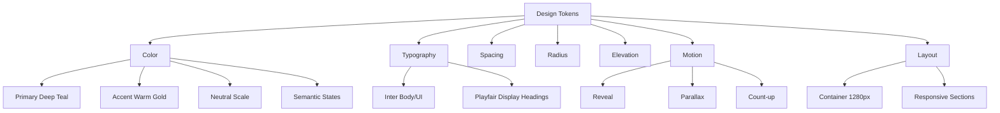

<!--
  @file DESIGN-SYSTEM.md
  @description Visual design system documentation for Colégio Villa Prime.
  @author CODEX-OPS
  @phase 8
  @created 2026-05-18T00:49:31Z
  @modified 2026-05-18T00:49:31Z
-->

# Design System

Fonte principal: `site/src/styles/global.css`. O sistema visual posiciona o Colégio Villa Prime como institucional premium: teal profundo, dourado quente, tipografia editorial e componentes com movimento sutil.

## Token Hierarchy

## Colors

### Primary: Deep Teal

| Token | Hex | Uso recomendado |
|---|---:|---|
| `--color-primary-50` | `#e6f2f5` | Backgrounds suaves e estados hover claros |
| `--color-primary-100` | `#b3d9e1` | Bordas leves em cards e botões secundários |
| `--color-primary-200` | `#80c0cd` | Realces, seleção e borders ativos |
| `--color-primary-300` | `#4da7b9` | Apoio visual e pequenos detalhes |
| `--color-primary-400` | `#268ea5` | Hover de links |
| `--color-primary-500` | `#006d84` | Gradientes, foco e ações principais |
| `--color-primary-600` | `#005c70` | Links, botões e ícones ativos |
| `--color-primary-700` | `#004a5c` | Gradientes escuros |
| `--color-primary-800` | `#004254` | Cor institucional principal, títulos |
| `--color-primary-900` | `#003040` | Fundos hero escuros |
| `--color-primary-950` | `#001e2b` | Fundos premium, overlays densos |

### Accent: Warm Gold

| Token | Hex | Uso recomendado |
|---|---:|---|
| `--color-accent-50` | `#fef9e7` | Background de tags e pills |
| `--color-accent-100` | `#fcedb5` | Background leve |
| `--color-accent-200` | `#fae183` | Texto em fundos escuros |
| `--color-accent-300` | `#f8d551` | Hover em breadcrumbs |
| `--color-accent-400` | `#f6c91f` | Dots, halos e pontos de atenção |
| `--color-accent-500` | `#d4a910` | CTA visual, números e foco |
| `--color-accent-600` | `#a3830c` | Ícones e texto dourado |
| `--color-accent-700` | `#725d09` | Texto em tags claras |

### Neutrals and Semantic

| Grupo | Tokens | Uso |
|---|---|---|
| Neutral | `50` a `950`, de `#fafafa` a `#0a0a0a` | Texto, bordas, fundos e estados discretos |
| Surface | `#ffffff`, `#f8fafb`, `#004254` | Superfícies principais, muted e dark |
| Success | `#10b981` | Estados positivos |
| Warning | `#f59e0b` | Alertas |
| Error | `#ef4444` | Erros de formulário |
| Info | `#3b82f6` | Informação contextual |

## Typography

| Uso | Família | Peso | Observação |
|---|---|---|---|
| Body/UI | `Inter` | 400-700 | Interface, parágrafos, botões, labels |
| Display | `Playfair Display` | 600-800 | Títulos, hero, números de destaque |
| Mono | `JetBrains Mono` fallback | Normal | Reservado para código ou dados técnicos |

### Scale

| Token | Valor |
|---|---:|
| `--text-xs` | `0.75rem` |
| `--text-sm` | `0.875rem` |
| `--text-base` | `1rem` |
| `--text-lg` | `1.125rem` |
| `--text-xl` | `1.25rem` |
| `--text-2xl` | `1.5rem` |
| `--text-3xl` | `1.875rem` |
| `--text-4xl` | `2.25rem` |
| `--text-5xl` | `3rem` |
| `--text-6xl` | `3.75rem` |
| `--text-7xl` | `4.5rem` |

Headings usam Playfair Display, `line-height: 1.2` e cor `primary-800`. No mobile (`max-width: 768px`), os tamanhos de heading reduzem para preservar leitura.

## Spacing

| Token | Valor |
|---|---:|
| `--space-1` | `0.25rem` |
| `--space-2` | `0.5rem` |
| `--space-3` | `0.75rem` |
| `--space-4` | `1rem` |
| `--space-5` | `1.25rem` |
| `--space-6` | `1.5rem` |
| `--space-8` | `2rem` |
| `--space-10` | `2.5rem` |
| `--space-12` | `3rem` |
| `--space-16` | `4rem` |
| `--space-20` | `5rem` |
| `--space-24` | `6rem` |
| `--space-32` | `8rem` |

Seções usam `.section`, `.section-sm` e `.section-lg`, com padding vertical de `5rem`, `3rem` e `8rem`.

## Radius

| Token | Valor | Uso |
|---|---:|---|
| `--radius-sm` | `0.25rem` | Focus rings e elementos pequenos |
| `--radius-md` | `0.5rem` | Ícones e pequenos blocos |
| `--radius-lg` | `0.75rem` | Cards e accordions |
| `--radius-xl` | `1rem` | Galerias, lightbox e painéis |
| `--radius-2xl` | `1.5rem` | Blocos premium maiores |
| `--radius-full` | `9999px` | Pills, CTAs e botões circulares |

## Shadows

| Token | Uso |
|---|---|
| `--shadow-sm` | Separação sutil em cards e badges |
| `--shadow-md` | CTAs e elementos interativos |
| `--shadow-lg` | Formulários e cards elevados |
| `--shadow-xl` | Hover premium e lightbox |
| `--shadow-glow` | Realce teal em interações especiais |

## Gradients

| Classe | Uso |
|---|---|
| `.bg-gradient-primary` | Fundo teal institucional |
| `.bg-gradient-warm` | CTA final e blocos de conversão |
| `.bg-gradient-hero` | Hero fallback sem imagem |

CTAs primários usam gradiente `primary-700 -> primary-500`. Números de `TrustBadge` usam gradiente dourado.

## Glass Effects

| Classe | Composição |
|---|---|
| `.glass` | `rgba(255,255,255,.85)` + `backdrop-filter: blur(12px)` |
| `.glass-dark` | `rgba(0,66,84,.85)` + `backdrop-filter: blur(12px)` |

Usar glass apenas onde há fundo visual suficiente para justificar blur. Em conteúdo longo, preferir superfícies sólidas para leitura.

## Motion

| Animação | Uso |
|---|---|
| `fadeInUp` | Entrada de conteúdo e blocos |
| `fadeIn` | Aparição simples |
| `slideInLeft` | Entrada lateral |
| `pulse-soft` | Ênfase controlada |
| `float` | Movimento leve decorativo |
| `heroFadeInUp` | Stagger do Hero |
| `heroScrollBounce` | Cue de rolagem |
| `faqFadeIn` | Resposta de FAQ |
| `lightboxIn` | Entrada do dialog de galeria |
| `spin` | Loading do formulário |

O script `src/scripts/scroll-reveal.ts` ativa `.reveal.visible`, count-up e comportamentos de scroll. Todo movimento respeita `prefers-reduced-motion`.

## Breakpoints

| Breakpoint | Uso observado |
|---|---|
| `640px` | Grids de formulário/galeria e ajustes mobile |
| `768px` | Redução de headings e parallax mobile |
| `1024px` | Galeria 3 colunas e layouts internos |
| `1280px` | Container máximo (`--container-max`) |

## Usage Rules

- Use `primary-800` para autoridade institucional.
- Use dourado como acento, não como cor dominante.
- Use Playfair para títulos e Inter para todo texto de interface.
- Prefira `transform` e `opacity` para animações.
- Sempre implemente `:focus-visible` em controles interativos.
- Em mobile, preserve espaçamento e leitura antes de efeitos visuais.
