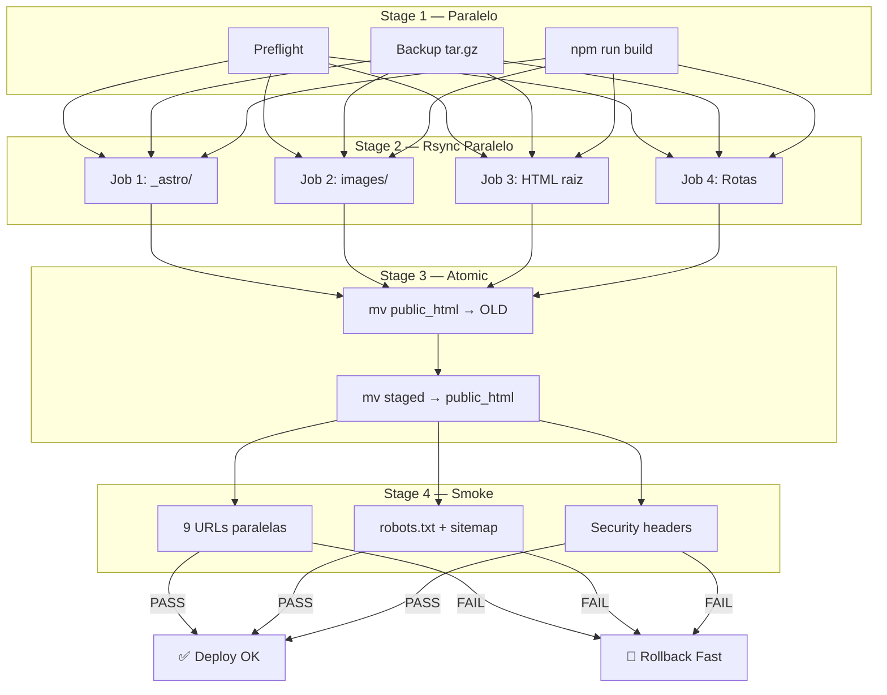

<!--
  @file README.md
  @description Deploy scripts v2 documentation — atomic staged parallel pipeline.
  @author CODEX-OPS
  @phase 7-PRE
  @created 2026-05-18T00:16:32Z
  @modified 2026-05-18T00:16:32Z
-->

# Deploy Scripts v2 — Atomic Staged Parallel

Pipeline de deploy zero-downtime para HostGator via SSH/rsync com switch atômico.

## Scripts

| Script | Tipo | Descrição |
|--------|------|-----------|
| `hostgator-deploy-v2.ps1` | Orquestrador | Pipeline completo: paralleliza preflight+backup+build, rsync staged, atomic switch, smoke |
| `hostgator-preflight.ps1` | Validação | SSH connectivity, .env.deploy.local, disk space, dist/ check |
| `hostgator-backup.ps1` | Backup | tar.gz remoto em ~/backups/ com rotação (keep 5) |
| `hostgator-rsync-parallel.ps1` | Upload | 4 jobs rsync paralelos para staged dir (zero impacto em produção) |
| `hostgator-atomic-switch.ps1` | Switch | mv atômico: public_html→OLD, staged→public_html (<1s) |
| `hostgator-smoke-parallel.ps1` | Validação | 9 rotas + robots + sitemap em paralelo (HTTP 200 + title + headers) |
| `hostgator-rollback-fast.ps1` | Rollback | mv reverso da versão OLD (<2s) |
| `hostgator-rollback-tar.ps1` | Emergency | Restore de tar.gz backup (~30s, usar se rollback-fast falhar) |

## Fluxo Paralelo



## Comparação v1 vs v2

| Métrica | v1 (sequencial) | v2 (atomic paralelo) |
|---------|-----------------|----------------------|
| Downtime | ~30s (CSS/HTML mismatch) | **0s** (atomic mv) |
| Tempo total | ~90s | ~30-60s |
| Rollback | ~30s (tar extract) | **<2s** (mv reverso) |
| rsync | 1 thread | 4 threads paralelos |
| Preflight+Backup | Sequencial | Paralelo (Start-Job) |
| Smoke test | 4 checks sequenciais | 11 checks paralelos |
| Versões preservadas | 3 tar.gz | 3 OLD dirs + 5 tar.gz |

## Uso

### Deploy completo (produção)

```powershell
cd site/scripts
.\hostgator-deploy-v2.ps1
```

### Dry-run (simula sem alterar produção)

```powershell
.\hostgator-deploy-v2.ps1 -DryRun
```

### Skip preflight (re-deploy rápido)

```powershell
.\hostgator-deploy-v2.ps1 -SkipPreflight
```

### Rollback rápido (<2s)

```powershell
.\hostgator-rollback-fast.ps1
```

### Rollback de versão específica

```powershell
.\hostgator-rollback-fast.ps1 -Version 1716000000
```

### Rollback de emergência (tar.gz)

```powershell
.\hostgator-rollback-tar.ps1
.\hostgator-rollback-tar.ps1 -BackupFile backup_20260518_001500.tar.gz
```

### Scripts individuais

```powershell
.\hostgator-preflight.ps1          # Validar pré-condições
.\hostgator-backup.ps1             # Backup manual
.\hostgator-rsync-parallel.ps1     # Upload para staged dir
.\hostgator-atomic-switch.ps1      # Switch manual
.\hostgator-smoke-parallel.ps1     # Smoke test manual
```

## Pré-requisitos

- PowerShell 5.1+ (Windows) ou 7+ (cross-platform)
- `ssh`, `rsync`, `npm`, `curl.exe` no PATH
- `site/.env.deploy.local` configurado (copiar de `.env.deploy.example`)
- Chave SSH configurada para o servidor HostGator

## Variáveis de Ambiente (.env.deploy.local)

```env
DEPLOY_HOST=xxx.xxx.xxx.xxx
DEPLOY_USER=cri07713
DEPLOY_PATH=/home2/cri07713/public_html
DEPLOY_PORT=22
DEPLOY_DOMAIN=https://www.colegiovillaprime.com.br  # opcional
```

## Arquivamento v1

Os scripts v1 (sequenciais) estão preservados em `v1-archive/` para referência.
